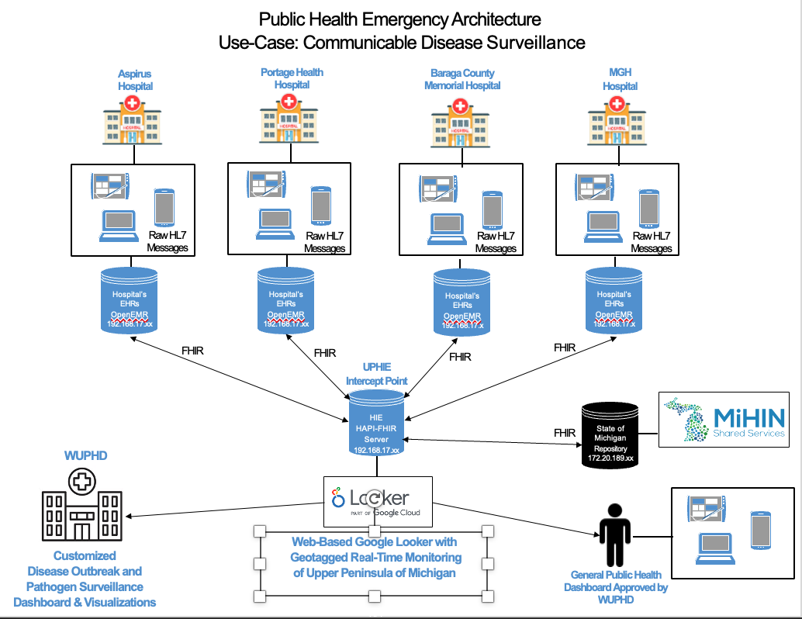

# 🏥 Public Health Emergency Architecture: Communicable Disease Surveillance

## 📌 Project Overview

This project implements a **Public Health Emergency Surveillance System** using virtual machines (VMs) configured with **OpenEMR** and a centralized **HAPI-FHIR server** for real-time data sharing. It is designed to simulate how regional hospitals can integrate Electronic Health Records (EHRs) with a central Health Information Exchange (HIE) for public health monitoring and disease outbreak management.

> **Use Case:** Communicable Disease Surveillance across multiple hospital nodes in Michigan’s Upper Peninsula region.

---

## 🎯 Objectives

- Deploy a virtualized hospital network architecture for health data interoperability.
- Configure EHR systems (OpenEMR) for each hospital node.
- Set up a centralized FHIR-based HIE (HAPI FHIR Server) using Docker.
- Enable RESTful communication using FHIR standards between hospitals and HIE.
- Facilitate real-time surveillance dashboards using Google Looker.

---

## 🧰 Technologies Used

| Layer                     | Technology/Tool                  |
|--------------------------|----------------------------------|
| Virtualization           | VMware vCenter Cluster (MTU CCC) |
| EHR Systems              | OpenEMR (v6.0.0)                  |
| Interoperability         | HAPI FHIR Server (Dockerized)    |
| API Testing              | Postman, Swagger UI              |
| Public Health Dashboards | Google Looker                    |
| OS                       | Ubuntu Server                    |
| Networking               | Custom VLAN (pv-stu-v3XXX)       |
| IP Addressing            | Static IPs per VM                |

---

## 🏗️ Architecture Diagram

The architecture includes four hospital nodes and one central HIE node, simulating the data flow for public health reporting.

- Each hospital runs OpenEMR on a dedicated VM.
- HL7 messages are transformed into FHIR resources.
- FHIR data is pushed to the UPHIE (HAPI-FHIR Server).
- Data is visualized via dashboards using Google Looker.

---

## 📂 VM Configuration

| Hospital / HIE      | Software     | IP Format          | HAPI-FHIR | OpenEMR | Pinged All VMs |
|---------------------|--------------|---------------------|------------|---------|----------------|
| Aspirus             | OpenEMR      | 192.168.17.218       | ❌         | ✅      | ✅              |
| Portage Health      | OpenEMR      | 192.168.17.219       | ❌         | ✅      | ✅              |
| BCMH                | OpenEMR      | 192.168.17.220       | ❌         | ✅      | ✅              |
| MGH                 | OpenEMR      | 192.168.17.221       | ❌         | ✅      | ✅              |
| UPHIE (Central HIE) | HAPI FHIR    | 192.168.17.222       | ✅         | ❌      | ✅              |

---

## ⚙️ Key Functionalities

- 🛠️ **OpenEMR Installation** using LAMP stack on Ubuntu
- 🐳 **HAPI-FHIR Setup** using Docker with custom `application.yaml`
- 🌐 **REST API Integration** via Postman (CRUD on FHIR resources)
- 📊 **Google Looker Dashboards** for disease outbreak tracking
- 🔄 **Full FHIR Interoperability** between VMs

---

## 🧪 Testing & Validation

- Verified REST API endpoints with Postman.
- Confirmed VM-to-VM network connectivity using `ping`.
- Successfully performed CRUD operations on FHIR Practitioner resources.
- Confirmed UI access to both OpenEMR and HAPI-FHIR interfaces.

---

## 🚧 Challenges Faced

- Docker networking issues during initial HAPI FHIR deployment.
- Manual configuration of Apache for OpenEMR across multiple VMs.
- Ensuring all nodes could successfully ping each other over the private VLAN.
- Syncing FHIR formats between OpenEMR and HAPI-FHIR endpoint.

---

## ✅ Outcomes

- Achieved successful integration of a multi-node EMR system with a central HIE.
- Enabled secure and standardized data sharing via the FHIR protocol.
- Visualized public health data with cloud-based dashboards.
- Gained hands-on experience with healthcare interoperability standards and architecture.

---

## 👨‍⚕️ Contributors

- *Aakash Walavalkar*

---

## 📄 License

This project is part of SAT5424 (Spring 2025) at Michigan Technological University. For academic use only.
